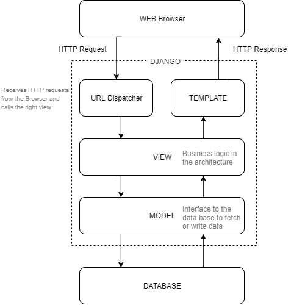

# Django in a nut shell

Course from Maximilian Schwarzmüller: [git](https://github.com/academind/django-practical-guide-course-code)

## Template-View-Model Pattern



## Create new project

```shell
django-admin startproject PROJECT_NAME
```

## *Start server:* 

```shell
python manage.py runserver
```
 
NOTE: Hit `CTRL + BREAK` or `CTRL + C` to stop the development server.


## Create new App:

```shell
django-admin startapp APP_NAME
```

## Create data base - migration

```shell
1 python manage.py migrate
2 python manage.py makemigrations
3 python manage.py migrate
4 python manage.py shell
```

  1. to create the DB and migrate changes into it
  2. take over App into the DB
  3. update the DB with the App changes
  4. opens the python shell, which can be used to interact with the migrated models / database tables:

```python
1 >>> from l2app.models import Topic        # l2app is the django App
2 >>> t= Topic(top_name="Sicial Network")
3 >>> t.save()
4 >>> exit()
```

1. `l2app` is the name of the app. The model `Topic` is imported
2. New data entry for the table `Topic` is created
3. The data entry is stored into the data base in the table `Topic`
4. To leave the python shell


## Django folder structure

### Django project

* _djangoProjecName_
    * _djangoProjecName_
        * init.py
        * settings.py: all project's configurations	
        * urls.py: routes mapping within the project [doc](https://docs.djangoproject.com/en/3.2/topics/http/urls/ )
        * wsgi.py: small gateway interface for deployment [doc](https://docs.djangoproject.com/en/3.2/howto/deployment/wsgi/)
        * asgi.py: small gateway interface for deployment [doc](https://docs.djangoproject.com/en/3.2/howto/deployment/asgi/)
    * manage.py: Django command line utility [doc](https://docs.djangoproject.com/en/3.2/ref/django-admin/)
    * **_templates_**: Django template engine
    * **_static_**: Folder for static files, such as CSS, or Js etc.
    * **_APP_NAME_**: Folder created by creating a new App in the project. The name can be selected by creating new App.

#### Project settings

* settings.py: 

### Django APP
* **_migrations_**:
* **_templates_**: folder contains web site templates of the App
* **_static_**: similar to templates folder for App specific static files
* `__init.py__`: tells Python to treat the directory as a Python package.
* admin.py: contains settings for the Django admin pages.
* apps.py: contains settings for the application configuration.
* models.py: contains a series of classes that Djangos ORM converts to database tables.
* views.py: contains functions and classes that handle what data is displayed in the HTML templates.
* tests.py: contains test classes


# Links

[FastHTML with HTMLX](https://simn.fr/posts/dicthing-django-admin-for-fasthtml)
[Nanodjango](https://radiac.net/blog/2025/01/monkeypatching-django/)
[Fake Django model for Testing](https://www.djangotricks.com/blog/2024/05/generating-fake-django-model-instances-with-factory-boy/)

* urls.py: routes mapping within the project [doc](https://docs.djangoproject.com/en/5.0/topics/http/urls/)
* wsgi.py: small gateway interface for deployment [doc](https://docs.djangoproject.com/en/5.0/howto/deployment/wsgi/)
* asgi.py: small gateway interface for deployment [doc](https://docs.djangoproject.com/en/5.0/howto/deployment/asgi/)
* manage.py: Django command line utility [doc](https://docs.djangoproject.com/en/5.0/ref/django-admin/)

## Web design

### HTML

https://www.html-seminar.de/einsteiger.htm

### CSS

https://www.html-seminar.de/css-lernen.htm